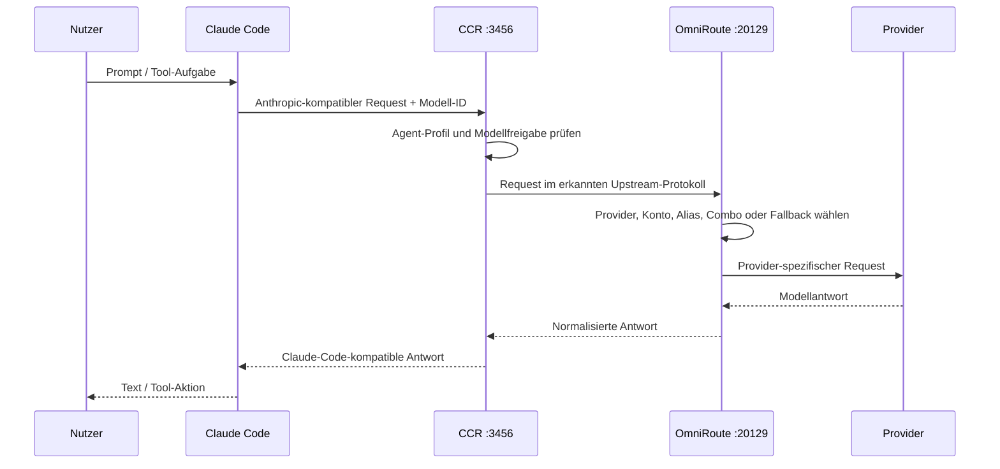

# Architektur

Diese Seite fokussiert den LLM-Datenfluss **innerhalb des Mac mini**. Die Geräte-, Remote- und Hermes-Gesamtarchitektur steht unter [Gesamtsystem](system.html).

## Datenfluss

## Verantwortungsgrenzen

### Claude Code

- startet Sessions und Agenten,
- zeigt den `/model`-Picker,
- liest die Gateway-Modellliste, wenn Discovery aktiviert ist,
- sendet Requests an den konfigurierten Anthropic-Basis-Endpunkt.

### Codex auf dem Mac mini

- verwendet CCR als `model_provider`,
- spricht CCR unter `http://127.0.0.1:3456/v1` über die Responses-Schnittstelle an,
- nutzt einen von CCR bereitgestellten Modellkatalog,
- ist damit ein zweiter Client derselben Gateway-Schicht, nicht ein Unterprozess von Claude Code.

### CCR

- ist der einzige direkte Gateway-Endpunkt für Claude Code,
- exponiert eine kuratierte Liste von OmniRoute-Modellen,
- hält das Claude-Code-Agent-Profil und den Default fest,
- erkennt am OmniRoute-Upstream mehrere Protokolle, darunter OpenAI Chat Completions, OpenAI Responses, Anthropic Messages und Gemini Generate Content.

### OmniRoute

- verwaltet Provider-Verbindungen und deren Zugangsdaten,
- mappt Modell-IDs auf konkrete Providerpfade,
- kann Konten verteilen, Combos, Aliase, Retries und Fallbacks einsetzen,
- normalisiert Requests und Responses zwischen Protokollen.

### Hermes Agent

- läuft parallel zu CCR und OmniRoute,
- verwaltet eigene Profile, Toolsets, Sessions und Delegation,
- kann Cloud-Provider direkt oder lokale Ollama-/MLX-Endpunkte verwenden,
- ist nicht automatisch Teil jedes CCR-Requests.

## Warum zwei Router?

OmniRoute ist der allgemeine Multi-Provider-Router. CCR ist die Claude-Code-spezifische Präsentationsschicht. Diese Aufteilung vermeidet, dass Claude Code den gesamten heterogenen OmniRoute-Katalog selbst interpretieren muss.

Der zusätzliche Hop ist lokal und bringt einen klaren Vorteil: Die in Claude Code sichtbare Modellliste wird von CCR kontrolliert, während die bereits eingerichteten OmniRoute-Provider unverändert weiterverwendet werden.

Für Codex erfüllt CCR zusätzlich die Rolle eines OpenAI-Responses-kompatiblen Providers. Hermes bleibt bewusst entkoppelt, damit seine Profile und lokalen Modellpfade unabhängig vom Claude-Code-Modellkatalog betrieben werden können.
