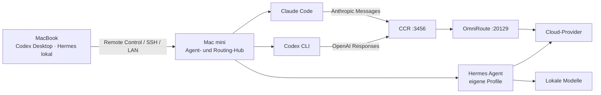

# Zwei Macs, mehrere Agenten, ein Routing-Hub

Diese Dokumentation beschreibt das produktiv verwendete Setup aus MacBook und Mac mini. Das MacBook ist die interaktive Arbeits- und Steuerungsebene. Der Mac mini ist der dauerhaft laufende Agent-, Gateway- und Modell-Hub. Dort teilen sich Claude Code und Codex den Einstieg über Claude Code Router (CCR); Hermes Agent besitzt daneben eigene Provider- und Profilpfade.

## Kurzfassung

| Schicht | Adresse | Aufgabe |
|---|---|---|
| Claude Code | Client | Arbeitsoberfläche und Agent |
| Codex auf Mac mini | Client | Coding-Agent; nutzt CCR über die Responses-Schnittstelle |
| Hermes Agent | Agentenplattform | Profile, Tools, Delegation sowie direkte Cloud-/lokale Providerpfade |
| CCR Gateway | `http://127.0.0.1:3456` | Claude-Code-kompatibler Einstieg, Modellkatalog, Agent-Profil |
| CCR Web UI | `http://127.0.0.1:3458` | Verwaltung von Provider, Modellen und Routing |
| OmniRoute | `http://127.0.0.1:20129` | Multi-Provider-Gateway, Protokollübersetzung und Upstream-Routing |

## Aktuell exponierte Modellbeispiele

- MiniMax M3: `minimax/MiniMax-M3`
- Qwen 3.8 Max Preview: `qct/qwen3.8-max-preview` und `qwen-cloud-token-plan/qwen3.8-max-preview`
- DeepSeek V4 Pro: `qct/deepseek-v4-pro` und `qwen-cloud-token-plan/deepseek-v4-pro`
- GLM 5.3: `zai/GLM-5.3` sowie `zai/GLM-5.3-Flash`

Gleiche Anzeigenamen können aus mehreren Provider-Pfaden stammen. Die vollständige Modell-ID ist deshalb die verlässliche Identität.

## Leitprinzipien

1. MacBook und Mac mini besitzen getrennte lokale Konfigurationen; `127.0.0.1` meint immer das jeweilige Gerät.
2. Claude Code und Codex auf dem Mac mini kennen CCR als Gateway.
3. CCR exponiert bewusst nur ausgewählte Modelle, nicht den gesamten OmniRoute-Katalog.
4. Hermes ist ein paralleler Agentenpfad und muss nicht durch CCR oder OmniRoute laufen.
5. Secrets bleiben ausschließlich in lokalen Secret-Stores, Datenbanken oder `.env`-Dateien.
6. Diese öffentliche Dokumentation enthält nur Architektur, nicht verwendbare Zugangsdaten.

Weiter: [Gesamtsystem](system.html) · [Architektur](architecture.html) · [Konfiguration](configuration.html) · [Troubleshooting](troubleshooting.html)
