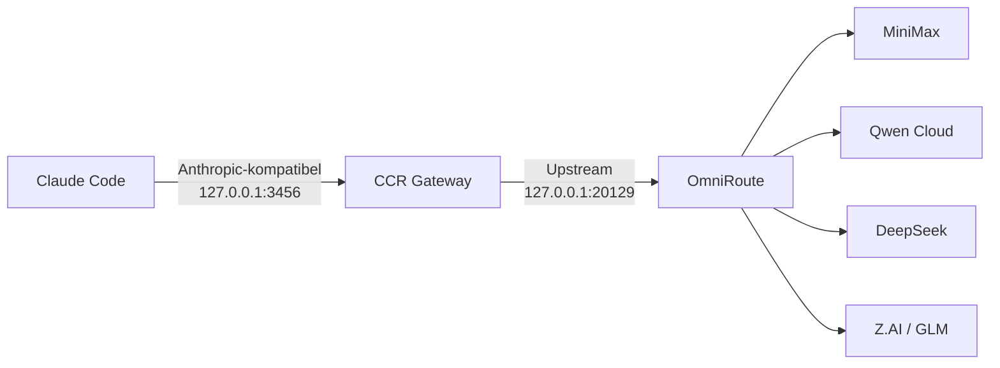

# Ein Einstieg, viele Modelle

Diese Dokumentation beschreibt das produktiv verwendete lokale Setup auf dem Mac mini. Claude Code spricht ausschließlich mit Claude Code Router (CCR). CCR stellt einen kontrollierten Modellkatalog bereit und leitet die Requests an OmniRoute weiter. OmniRoute übernimmt die eigentliche Provider-Auswahl, Protokollanpassung, Kontenwahl und optionale Fallback-Logik.

## Kurzfassung

| Schicht | Adresse | Aufgabe |
|---|---|---|
| Claude Code | Client | Arbeitsoberfläche und Agent |
| CCR Gateway | `http://127.0.0.1:3456` | Claude-Code-kompatibler Einstieg, Modellkatalog, Agent-Profil |
| CCR Web UI | `http://127.0.0.1:3458` | Verwaltung von Provider, Modellen und Routing |
| OmniRoute | `http://127.0.0.1:20129` | Multi-Provider-Gateway, Protokollübersetzung und Upstream-Routing |

## Aktuell exponierte Modellbeispiele

- MiniMax M3: `minimax/MiniMax-M3`
- Qwen 3.8 Max Preview: `qct/qwen3.8-max-preview` und `qwen-cloud-token-plan/qwen3.8-max-preview`
- DeepSeek V4 Pro: `qct/deepseek-v4-pro` und `qwen-cloud-token-plan/deepseek-v4-pro`
- GLM 5.3: `zai/GLM-5.3` sowie `zai/GLM-5.3-Flash`

Gleiche Anzeigenamen können aus mehreren Provider-Pfaden stammen. Die vollständige Modell-ID ist deshalb die verlässliche Identität.

## Leitprinzipien

1. Claude Code kennt nur CCR als Gateway.
2. CCR exponiert bewusst nur ausgewählte Modelle, nicht den gesamten OmniRoute-Katalog.
3. OmniRoute bleibt die zentrale Stelle für Provider-Zugänge und Routing.
4. Secrets bleiben ausschließlich in lokalen Secret-Stores, Datenbanken oder `.env`-Dateien.
5. Diese öffentliche Dokumentation enthält nur Architektur, nicht verwendbare Zugangsdaten.

Weiter: [Architektur](architecture.html) · [Konfiguration](configuration.html) · [Troubleshooting](troubleshooting.html)

