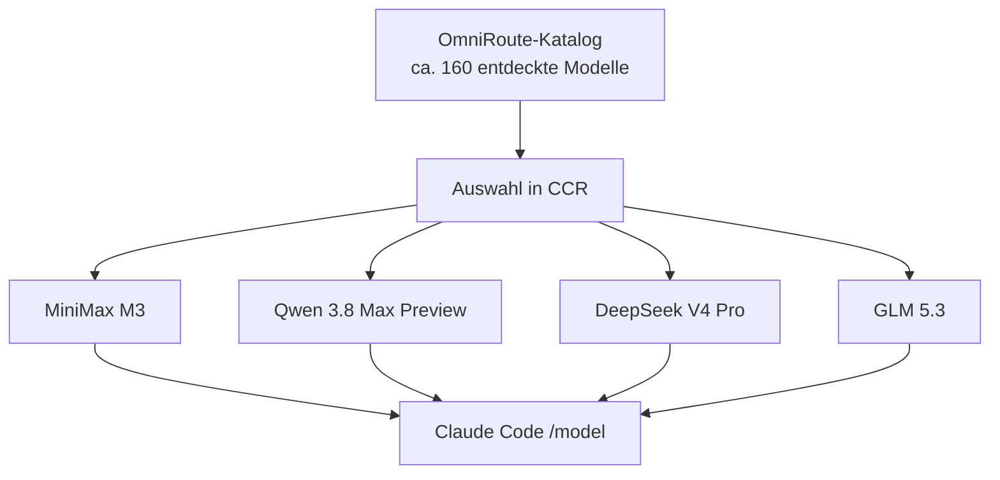

# Modelle und Routing

## Warum OmniRoute allein im `/model`-Picker nicht genügte

OmniRoute konnte einen großen Modellkatalog bereitstellen und Nicht-Claude-Modelle auch direkt ausführen. Claude Codes Gateway Discovery übernahm aus dem direkten OmniRoute-Katalog jedoch nur neun Claude-artige Modell-IDs. Der lokale Gateway-Cache belegte dieses Muster: sichtbar waren vor allem IDs mit `claude`, `opus`, `sonnet` oder `haiku`.

Das Problem lag damit nicht bei der grundsätzlichen Erreichbarkeit der Modelle. Es lag an der Darstellung beziehungsweise Filterung des heterogenen Gateway-Katalogs für Claude Code.

Ein getesteter OmniRoute-Modellalias löste das nicht: Aliase schreiben Requests um, erzeugten aber keinen zusätzlichen Discovery-Eintrag. Auch das Umschalten eines Zielformats auf Anthropic Messages ändert primär das Transportformat, nicht automatisch die im Picker sichtbare Modellidentität.

## Warum CCR vorgeschaltet wurde

CCR besitzt einen eigenen Modellkatalog für Claude Code. Es entdeckt OmniRoute-Modelle, prüft unterstützte Protokolle und exponiert nur die ausgewählten Einträge. Dadurch erscheinen auch MiniMax, Qwen, DeepSeek und GLM im `/model`-Picker, ohne OmniRoute oder die Provider-Konfiguration zu ersetzen.

## Aktuelle Auswahl

| Familie | CCR-/OmniRoute-ID | Bemerkung |
|---|---|---|
| MiniMax | `minimax/MiniMax-M3` | derzeitiger Hauptdefault |
| MiniMax | `minimax/MiniMax-M2.7-highspeed` | schnelle Alternative |
| DeepSeek | `oc/deepseek-v4-flash-free` | freie Flash-Variante |
| DeepSeek | `qct/deepseek-v4-pro` | Providerpfad 1 |
| DeepSeek | `qwen-cloud-token-plan/deepseek-v4-pro` | Providerpfad 2 |
| GLM | `zai/GLM-5.3` | Vollmodell |
| GLM | `zai/GLM-5.3-Flash` | schnelle Variante |
| Qwen | `qct/qwen3.8-max-preview` | Providerpfad 1 |
| Qwen | `qwen-cloud-token-plan/qwen3.8-max-preview` | Providerpfad 2 |

## Provider- und Routing-Prinzipien

- Die vollständige Modell-ID entscheidet; identische Anzeigenamen können verschiedene Providerpfade meinen.
- CCR kontrolliert Sichtbarkeit und Agent-Defaults, OmniRoute kontrolliert Upstream-Zugang und Provider-Routing.
- Ein Modell wird erst in CCR ausgewählt, nachdem die Verbindung und mindestens ein passendes Protokoll erfolgreich geprüft wurden.
- Provider-spezifische Retries, Kontenrotation, Quotenlogik und Fallbacks gehören in OmniRoute.
- Claude-Code-spezifische Defaults, Subagent-Modell und sichtbare Modellliste gehören in CCR beziehungsweise Claude Code.
- Fallbacks sind in CCR derzeit deaktiviert; ein Fehler wird nicht still auf ein anderes CCR-Modell umgebogen.

