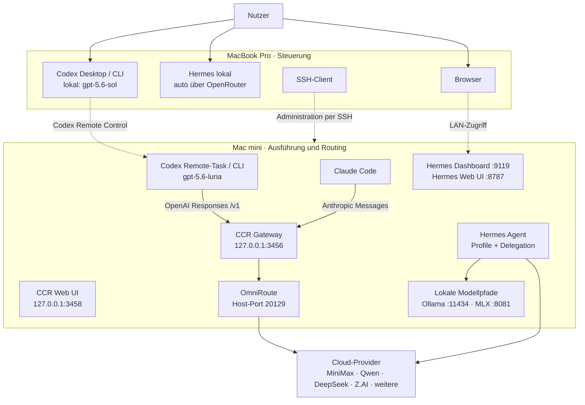

# Gesamtsystem: MacBook → Mac mini

## Geräteübersicht

| Gerät | Rolle | Wichtige Komponenten |
|---|---|---|
| MacBook Pro | interaktive Arbeits- und Steuerungsebene | Codex Desktop/CLI, lokale Hermes-Installation, Browser, SSH-Client |
| Mac mini (`192.168.178.129`) | dauerhaft laufender Ausführungs- und Routing-Hub | Claude Code, Codex CLI, Hermes Agent, CCR, OmniRoute, lokale Modellendpunkte und Web-UIs |

Beide Geräte laufen derzeit mit macOS 26.5. Das MacBook kann Aufgaben lokal ausführen oder über Codex Remote Control auf dem verbundenen Mac mini arbeiten. Für Administration und Diagnose existiert zusätzlich eine separate SSH-Verbindung zum Mac mini.



## Die drei Ausführungspfade

### 1. Claude Code auf dem Mac mini

Claude Code zeigt mit seinen Anthropic-Basisvariablen auf `http://127.0.0.1:3456`. CCR präsentiert die kuratierte Modellliste und leitet zum OmniRoute-Upstream weiter. Dieser Pfad ist für den `/model`-Picker und Claude-Code-Agenten optimiert.

### 2. Codex auf dem Mac mini

Codex CLI 0.149.0 verwendet ebenfalls CCR, aber über dessen OpenAI-kompatiblen Einstieg:

```text
Provider: claude-code-router
Base URL: http://127.0.0.1:3456/v1
Wire API: responses
Default: gpt-5.6-luna
```

Damit teilen sich Claude Code und Codex die Gateway-/Provider-Infrastruktur, obwohl sie unterschiedliche Client-Protokolle verwenden. Das CCR-Modellkatalog-JSON wird auch von Codex eingebunden.

### 3. Hermes Agent

Hermes Agent 0.20.5 ist eine parallele Agentenplattform. Auf dem Mac mini verwendet das Hauptprofil MiniMax M3; mehrere Fachprofile verwenden MiniMax M2.7 oder M3 direkt über den MiniMax-Anthropic-Endpunkt. Zusätzlich sind lokale Providerpfade zu Ollama und einem MLX-basierten Qwen-Endpunkt konfiguriert.

Hermes muss deshalb nicht zwingend den Weg `Hermes → CCR → OmniRoute` nehmen. Seine Provider, Profile, Toolsets und Delegation werden separat unter `~/.hermes` verwaltet.

## Hermes-Profile auf dem Mac mini

| Profil | Default-Modell | Zweck im Gesamtsystem |
|---|---|---|
| `appdirector` | MiniMax M3 | übergeordnete Produkt-/App-Steuerung |
| `fitness` | MiniMax M3 | eigener dauerhaft gestarteter Gateway-Kontext |
| `architect` | MiniMax M2.7 | Architekturarbeit |
| `builder` | MiniMax M2.7 | Implementierung |
| `planner` | MiniMax M2.7 | Planung |
| `reviewer` | MiniMax M2.7 | Review |
| `tester` | MiniMax M2.7 | Tests und Verifikation |
| `delivery` | MiniMax M2.7 | Auslieferung |
| `partner` | MiniMax M2.7 | allgemeine Zusammenarbeit |
| `devil` | MiniMax M2.7 | Gegenprüfung / kritische Perspektive |

Hermes-Delegation ist aktiviert, erlaubt bis zu zehn parallele Kinder bei einer maximalen Spawn-Tiefe von eins und vererbt MCP-Toolsets. Automatische Modellwahl für einfache Aufgaben (`smart_model_routing`) ist derzeit deaktiviert.

## MacBook: lokale Alternativen

Die Installationen auf dem MacBook sind eigenständig:

- Codex CLI 0.149.0 verwendet lokal `gpt-5.6-sol` mit mittlerem Reasoning-Aufwand.
- Hermes Agent 0.20.5 verwendet lokal einen automatischen Providerpfad über OpenRouter mit Claude Opus als Default.
- Diese lokalen Defaults werden nicht automatisch auf den Mac mini gespiegelt.

Vor einer Diagnose muss daher immer geklärt werden: **Läuft diese Session auf dem MacBook oder auf dem Mac mini?**

## Remote- und Netzwerkkanäle

| Kanal | Verwendung | Bemerkung |
|---|---|---|
| Codex Remote Control | Codex-Tasks auf dem Mac mini aus der Desktop-App | app-verwalteter Ausführungskanal |
| SSH | Wartung, Diagnose, Konfigurationsprüfung | separater Schlüssel; keine Secrets in der Doku |
| LAN-Webzugriff | Hermes Dashboard/Web UI | nur für vertrauenswürdiges lokales Netz oder über einen geschützten Tunnel |
| Loopback | CCR und interne lokale Aufrufe | `127.0.0.1` ist gerätespezifisch |

## „Switcher“ in diesem Setup

Es gibt keinen separat installierten Dienst namens „Switer“. In Hermes existieren jedoch mehrere Umschalter in der Oberfläche: Profil-, Session-, Workspace-, Projekt- und Connection-Switcher. Sie wählen einen Kontext innerhalb von Hermes aus; sie sind keine zusätzliche Proxy- oder Routing-Schicht.

Im Codex-Desktop-Kontext übernimmt die Host-/Projektwahl eine ähnliche Funktion: Ein Task kann auf dem MacBook oder auf dem verbundenen Mac mini laufen. Diese Auswahl bestimmt, welche lokale `~/.codex`, `~/.claude`- und `~/.hermes`-Konfiguration tatsächlich gilt.

## Autostart auf dem Mac mini

Über LaunchAgents werden derzeit automatisch gestartet:

- Hermes Standard-Gateway,
- ein separates Hermes-Gateway für das Profil `fitness`,
- Hermes Dashboard auf Port `9119`,
- Hermes Web UI auf Port `8787`.

CCR und OmniRoute laufen ebenfalls auf dem Mac mini; OmniRoute wird als Docker-Container mit dauerhaftem Volume betrieben.
